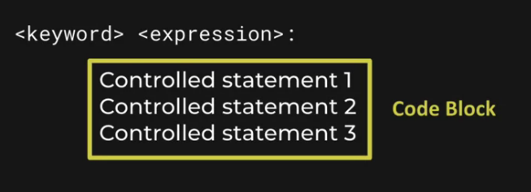

# python-pandas_DataEnginnner

## Entornos de python

Esto para crear un entorno vacío:
```
nvim setup-env.sh
source setup-env.sh
```


Para ver la documentación de pip:
```
pip help
```

Para ver la documentación del comando install:
```
pip help install
```

Para instalar el paquete **request**:

```
pip install requests
```

Para ver los paquetes instalados en el entorno actual:

```
pip list
```

Para ver las versiones disponibles del paquete **request**:
```
pip install requests==
```

Elija una versión anterior de **request** e instale esa versión:
```
pip install requests==2.25.1
```

Upgrade to the latest version:
```
pip install requests --upgrade
```

Guardar archivo de requisitos en Python:
```
pip freeze > requierements.txt
cat requierements.txt
```

Para desinstalar los requisitos:
```
pip uninstall -r requirements.txt
```

## Creación y uso de un entorno virtual Python

A partir de Python 3.5 se pueden generar entornos con la funcion `venv`:
```
python -m venv enviroment-name
```

Los pasos para la creacion del entorno virtual en un projecto son los siguientes:
```
mkdir my_new_project
cd my_new_project
python -m venv env
ls env 
source env/bin/activate
```

A partir de ahora todo lo que se instale con **pip** será guardado exclusivamente en este entorno virtual.

Para desactivar el entorno virtual se usa el comando `deactivate`

## Interactive Python Sell

```pip install ipython```

```ipython```


## Assigment Statements

```
a, b, c = 1, 3, 4 

#Para asignar mas de un valor a una variable se usa *
a, *b, c = 1,2,3,4,4,5

a += 1

a /= 2
```

## Import Module

```
import os
import pandas

os.getcwd()
os.path.isdir('.')
```

```
from os import path
path.isdir()

from os.path import isdir
isdir('.')

import pandas as pd
pd.DataFrame
```

## Other Simple Statements

- Expression Statements
- Assert Statements
- Assigment Statements
- Pass Statements 
- Del Statements
- Return Statements
- Yield Statements 
- Raise Statements
- Break Statements
- Continue Statements
- Import Statements
- Future Statements 
- Global Statements 
- Nonlocal Statements

## Compound Statements 

Controlling statement



**Keywords**

- if
- while
- for
- def

## Evaluating to True or False

- `==` Equals 
- `!=` Not Equals 
- `<` Less Than
- `<=` Lesst Than or Equal
- `>` Greater Than
- `>=` Greater Than or Equal

The comparison operators which compare by identity are **is** and **is not**. They are most commonly used to compare against the special object **None**.

```
print(1 is None)
print(True is not None)
```

### Membership Operations

Some objects in Python can contain others. For example, the word "Henry" (of type string), contains the letter "r" (also a string). The in operator tests for this type of membership. The expression "r" **in** "Henry" will return True, and "b" **in** "Henry" will return False.

```
print('e' in 'Henry')
print('a' not in 'Henry')
```

### Boolean Operations

- **and**
- **not**
- **or**

### Object Evaluations

All objects (everything) in Python evaluates as True or False. This means you can use them in the places where you would test for True or False, such as in Boolean operations. Generally, most Python objects evaluate as True. The exceptions are:

1. Numeric Types that equal zero, such as 0, or 0.0
2. The constants `False` and `None`
3. Anything that has a length of zero. This includes the empty string, `""`

### Basic if-statement syntax

```
if False:
  print('In the block')

print('After the block')
```

### Else syntax

```
score = 1

if score > 3:
  print('You win')
else:
  print('You Lose')
```

### Nested if-statements 

```
count = 2

if count < 3:
  print('Count more')
else:
  if count > 3:
      print('Count less')
```

### Elif syntax

```
count = 6

if count < 3:
  print('Count more')
elif count > 3:
  print('Count less')
elif count == 3:
  print('yes')
else:
  print('fall through')
```

### Match statements (pyhton 3.10)

```
temp = 38

match temp:
  case 33:
      print('too low')
  case 40:
      print('too high')
  case _:
      print('I don't know')
``` 

```
pos = (12, 13)

match pos:
  case (22, 33):
      print('one')
  case (12, y):
      print(y)
```

### While Loops

**Basic while syntax**

```
count = 0
while count < 5:
  print(count)
  count += 1
```

**Break statement**

```
count = 0

while count < 5:
  print(count)
  count += 1
  if count == 3:
      break
```

**Note**: Ensuring exit condition
 
## Functions

### Function syntax

```
def my_func():
  print('hi')
  
my_func()
```

### Pass statement 

"The pass statement is used as a placeholder for future code. When the pass statement is executed, nothing happens, but you avoid getting an error when empty code is not allowed. Empty code is not allowed in loops, function definitions, class definitions, or in if statements."

```
def do_nothing():
  pass

do_nothing == None
```

### Return statement

```
def ret_two():
  return 2

ret_two()
```

### Paramenters

``` 
def add_one(num):
  return num + 1

add_one(2)
add_one(6)
```

### Parameters by order and by name 

```
def my_func(first, second, third):
  print(first)
  print(second)
  print(third)
  
my_func(1,3,4)
my_func(third = 1, first = 4, second = 22)
```

### Setting default values

``` 
def say_hello(name = "Henri"):
  print("Hell" + name)
  
say_hello()
say_hello('June')
``` 

# Python Essentials

## Sequences

- **Lists** `[ 1, 2, 3 ]`
- **Tuples** `( 1, 2, 3 )`
- **Strings** `"123"`
- **Binary Strings** `b"123"`
- **Ranges Objects** `range(1, 4)`

### Shared Sequence Operations

- **Membership**

```
3 in [1,2,3,4,5]

12 not in [1,2,3,4,5]
```

- **Indexing**

```
name = "Monteverdi"
name[0]
```

- **Slicing**

```
name = "Palestrina
name[2:5]
name[:5]
name[4:]
name[-3:]
name[::2] #nos da toda la secuencia menos el indice que se pone
```

- **Interrogation**

```
len(name)
min(name)
max(name)
name.count('e')
name.index('i')
```

- **Math**

```
"prefix" + "-" + "pstfix"
[1,2] + [3,4]
[0,2] * 4
```
